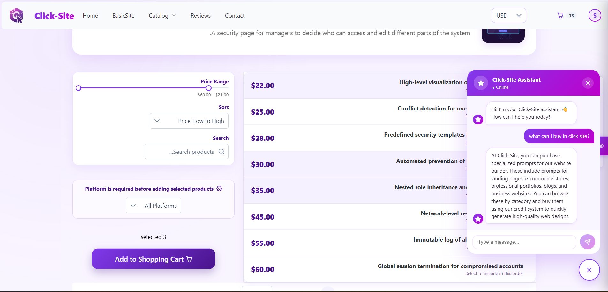

# 🛍️ AI-Driven Website Builder Prompt Store — Client

> The Angular frontend for the **AI-Driven Website Builder Prompt Store** — a platform that empowers non-technical users to visually design a website concept and instantly receive a professional, AI-ready prompt they can feed into any AI code generator.



---

## 📖 Project Overview

Building a website with AI tools is powerful — but only if you know how to write the right prompt. This platform removes that barrier.

Users browse a categorized catalog of prompt "products" (organized by site type, main category, and sub-category). They add items to a cart, check out via PayPal, and receive a polished, developer-grade AI prompt ready to be used in tools like GitHub Copilot, ChatGPT, or any AI code generator. A built-in Gemini AI chatbot further assists users in refining their choices.

### Key Features

- **Catalog Browsing** — Navigate site types, main categories, and sub-categories to find the right prompt product.
- **Shopping Cart & Checkout** — Full cart management with PayPal payment integration.
- **AI Chatbot** — Integrated Google Gemini AI chat assistant to help users choose the right prompt.
- **User Accounts** — Google OAuth sign-in, account settings, and order history.
- **Reviews** — Users can leave and browse product reviews.
- **Platform Guides** — Step-by-step guides on how to use the generated prompts on popular AI platforms.
- **Admin Panel** — Protected dashboard for managing products, categories, orders, users, and site types.
- **Accessibility** — Dedicated accessibility settings sidebar for an inclusive experience.

---

## 🧰 Technology Stack

| Layer | Technology |
|---|---|
| Framework | Angular 21 (standalone components) |
| Language | TypeScript 5.9 (strict mode) |
| UI Components | PrimeNG 21 + PrimeIcons + PrimeUix Lara theme |
| Styling | SCSS + Tailwind CSS 4 |
| Charts | Chart.js 4 |
| PDF Export | jsPDF |
| Authentication | Google OAuth (`@abacritt/angularx-social-login`) |
| Payments | PayPal (`paypalClientId` via environment) |
| Email | EmailJS |
| HTTP | Angular `HttpClient` |
| Reactive Extensions | RxJS 7 |
| Testing | Karma + Jasmine |
| Build Tool | Angular CLI / `@angular/build` |

---

## 🔗 Server Connection

This client communicates with a **C# .NET 9 REST API** backend.

- **Backend repository:** [https://github.com/le7-3609/web-api-shop](https://github.com/le7-3609/web-api-shop)
- **Default API URL (development):** `https://localhost:44371/api`

### How the connection works

All HTTP requests are routed through Angular's `HttpClient`. The `apiUrl` is injected via the environment file (`src/environments/environment.development.ts`). In development, a proxy (`proxy.conf.json`) forwards `/api/*` requests to the backend server to avoid CORS issues:

```json
{
  "/api": {
    "target": "https://localhost:44371",
    "secure": false,
    "changeOrigin": true
  }
}
```

### Environment variables (`src/environments/environment.development.ts`)

```typescript
export const environment = {
  production: false,
  apiUrl: 'https://localhost:44371/api',
  googleClientId: 'YOUR_GOOGLE_CLIENT_ID',
  paypalClientId: 'YOUR_PAYPAL_CLIENT_ID'
};
```

> **Note:** Replace the `googleClientId` and `paypalClientId` values with your own credentials before running the app. Do not commit real secrets to source control.

---

## 📋 Prerequisites

- **Node.js** LTS (v18 or v20 recommended)
- **npm** v9+
- The **backend server** running at `https://localhost:44371` (see backend repo setup below)

---

## 🚀 Getting Started

### 1. Clone the repository

```bash
git clone https://github.com/<your-username>/ClientPromptsShop.git
cd ClientPromptsShop
```

### 2. Install dependencies

```bash
npm ci
```

### 3. Set up the backend

Clone and run the backend server (required for API calls):

```bash
git clone https://github.com/le7-3609/web-api-shop.git
cd web-api-shop
# Update connection string in appsettings.json to point to your SQL Server
dotnet restore
dotnet run
```

The backend will start at `https://localhost:44371`.

### 4. Configure environment (optional)

If you need to change the API URL or credentials, edit `src/environments/environment.development.ts`.

### 5. Start the development server

```bash
npm start
```

Open your browser at **[http://localhost:5000](http://localhost:5000)**.  
The app reloads automatically on file changes.

---

## 🏗️ Build for Production

```bash
npm run build
```

Output is placed in `dist/`. Make sure to update `src/environments/environment.ts` with your production `apiUrl` and credentials before building.

---

## 🧪 Running Tests

```bash
npm test
```

Runs the test suite with Karma and Jasmine in a Chrome browser.

---

## 🛣️ Application Routes

| Path | Component | Notes |
|---|---|---|
| `/home` | Home | Landing page |
| `/auth` | Auth | Login & Register (Google OAuth) |
| `/main-category/:MainId` | MainCategory | Browse by main category |
| `/sub-category/:SubId` | SubCategory | Browse by sub-category |
| `/cart` | Cart | Shopping cart |
| `/checkout` | Checkout | PayPal checkout |
| `/payment-success` | PaymentSuccess | Post-payment confirmation |
| `/orders` | Orders | User order history |
| `/settings` | AccountSettings | User profile settings |
| `/all-reviews` | Reviews | All product reviews |
| `/platform-guides` | PlatformGuides | How-to guides for AI platforms |
| `/contact` | Contact | Contact form |
| `/privacy-policy` | PrivacyPolicy | Privacy policy page |
| `/terms-of-service` | TermsOfService | Terms of service page |
| `/accessibility` | Accessibility | Accessibility statement |
| `/admin` | AdminLayout | Admin panel (requires admin role) |
| `/**` | PageNotFound | 404 fallback |

---

## 🔐 Authentication & Authorization

- Users authenticate via **Google OAuth 2.0** using `@abacritt/angularx-social-login`.
- JWT tokens received from the backend are used to authorize API requests.
- The `/admin` route is protected by `adminGuard`, which verifies the user's role before allowing access.

---

## 🎨 Theming

The app uses PrimeNG with a custom **purple preset** built on the Lara theme. The primary color palette is defined in `app.config.ts` and applied globally.

---

## 🌐 Showcase: Real-World Usage

The following websites were generated by non-technical users using prompts created by the **AI-Driven Website Builder Prompt Store**:

| Project Name | Live Link |
| :--- | :--- |
| Big Harmony | [View Site](https://big-harmony.base44.app) |
| Grow Sync Flow | [View Site](https://grow-sync-flow.base44.app) |

> **Note:** These examples demonstrate the effectiveness of the system in translating user requirements into professional, functional web structures.

---

## 📄 License

This project is licensed under the [MIT License](LICENSE).

---

## 🙏 Acknowledgements

- Backend developed by [Elisheva Ashlag](https://github.com/le7-3609) and contributors.
- UI components powered by [PrimeNG](https://primeng.org/).
- AI chat powered by [Google Gemini](https://ai.google.dev/).
